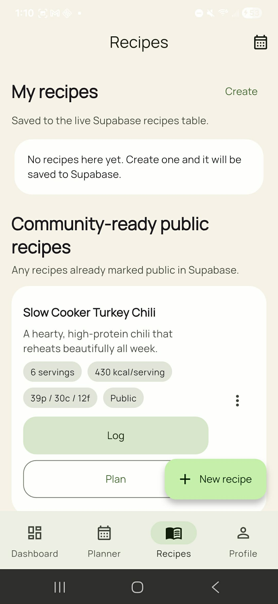
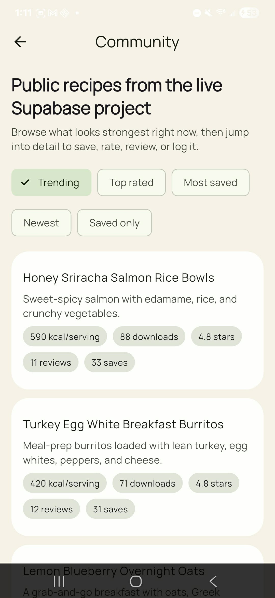
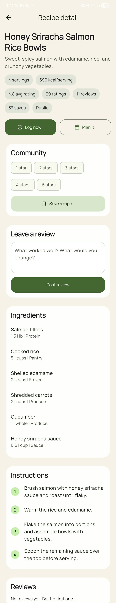
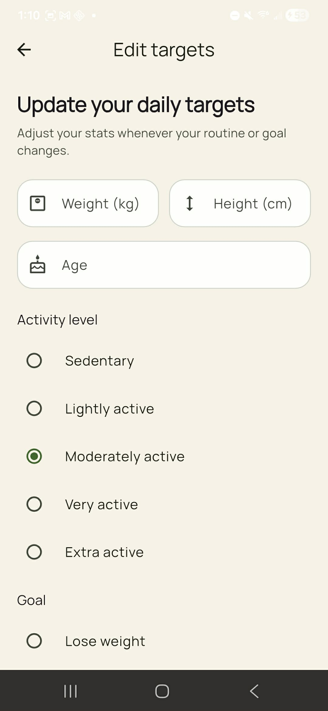

# FeastForged

FeastForged is a Flutter + Supabase mobile app for meal planning, recipe discovery, macro tracking, and community recipe interaction.

I built this project as a working product-style app rather than a UI mock: it includes authentication, onboarding, planner flows, recipe creation, community actions, shopping-list foundations, Supabase migrations, and device-tested user flows.

## What this project demonstrates

- End-to-end Flutter app architecture with feature-based organization
- Supabase-backed auth, data modeling, and SQL migrations
- Riverpod state management and GoRouter navigation
- Product thinking around onboarding, empty states, and launch readiness
- Real debugging and iteration on mobile-device issues, not just local happy paths

## Core features

- Email/password authentication with forgot-password support
- Onboarding flow for calorie and macro target setup
- Dashboard with calorie and macro progress
- Weekly meal planner
- Recipe browsing, creation, and detail views
- Recipe-to-planner handoff
- Recipe logging from planner into daily intake
- Community recipe save and rating actions
- Shopping-list and household foundations

## Tech stack

- Flutter
- Dart
- Riverpod
- GoRouter
- Supabase
- PostgreSQL / SQL migrations

## Architecture

The app is organized by feature area under `lib/features`, with shared routing, theme, and models under `lib/core` and `lib/shared`.

Primary feature areas:

- `auth`
- `dashboard`
- `nutrition`
- `planner`
- `recipes`
- `community`
- `shopping`
- `profile`
- `household`

## Database / Supabase

This repo includes Supabase migrations under [`supabase/migrations`](supabase/migrations) for:

- profile and onboarding data
- recipes
- meal plans and plan entries
- recipe log entries
- starter recipe seeds
- starter week seeds
- database hardening / performance alignment

## Notable implementation work

- Replaced fragile codegen-heavy MVP scaffolding with plain Dart models and providers when toolchain compatibility became an issue
- Hardened auth flows around email confirmation and password reset
- Fixed real Flutter layout/runtime issues discovered during Android device testing
- Synced the app toward the live Supabase schema for recipes, plans, and logging
- Improved launch-readiness UX with clearer actions, stronger empty states, and success feedback

## Current app status

This is a strong private-beta-quality app foundation. The repo includes working product flows, but it is still an in-progress product rather than a finished App Store release.

What has been verified:

- `flutter analyze`
- `flutter test`
- Android device launch
- auth flows
- planner -> log meal flow
- recipe -> planner flow
- community save / rating / planner handoff

## Screenshots

| Recipes | Community |
| --- | --- |
|  |  |

| Recipe detail | Profile target editing |
| --- | --- |
|  |  |

Representative in-app surfaces currently covered in the product flow:

- Dashboard progress and macro tracking
- Weekly meal planner
- Recipe browse and recipe detail
- Community browse with rating / save actions
- Profile target editing

## Running locally

1. Create or connect a Supabase project.
2. Apply the SQL migrations in [`supabase/migrations`](supabase/migrations).
3. Run the app with your Supabase URL and anon key:

```bash
flutter run --dart-define=SUPABASE_URL=https://your-project.supabase.co --dart-define=SUPABASE_ANON_KEY=your-anon-key
```

## Verification

```bash
flutter analyze
flutter test
```

Manual QA checklist:

- [MANUAL_SMOKE_TEST.md](MANUAL_SMOKE_TEST.md)

Launch-readiness notes:

- [LAUNCH_CHECKLIST.md](LAUNCH_CHECKLIST.md)
- [UX_REVIEW.md](UX_REVIEW.md)
- [APPLICATION_NOTES.md](APPLICATION_NOTES.md)
- [JOB_APPLICATION_COPY.md](JOB_APPLICATION_COPY.md)

## Why this repo is worth reviewing

This project shows more than just UI polish. It demonstrates:

- shipping-oriented engineering tradeoffs
- backend + frontend integration
- database design and migration work
- debugging against a real Android device
- iterative product improvement across multiple feature areas

## Next steps

If I continued this project, my next priorities would be:

- full community review create/edit/delete verification on-device
- richer shopping-list generation and editing
- stronger analytics / release instrumentation
- CI for analyze/test on every push
- store-ready release assets and signing
