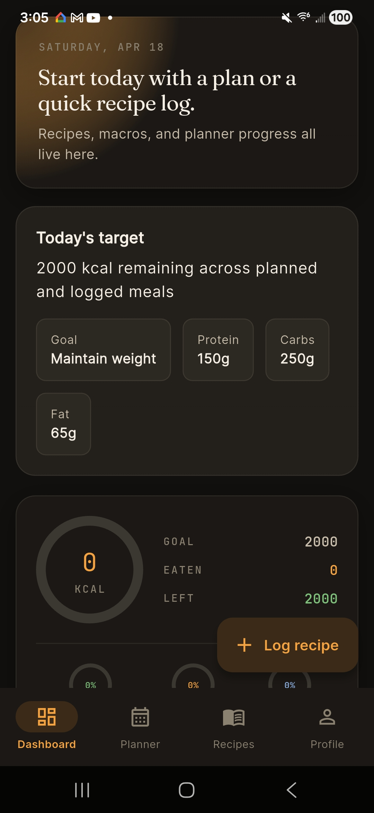
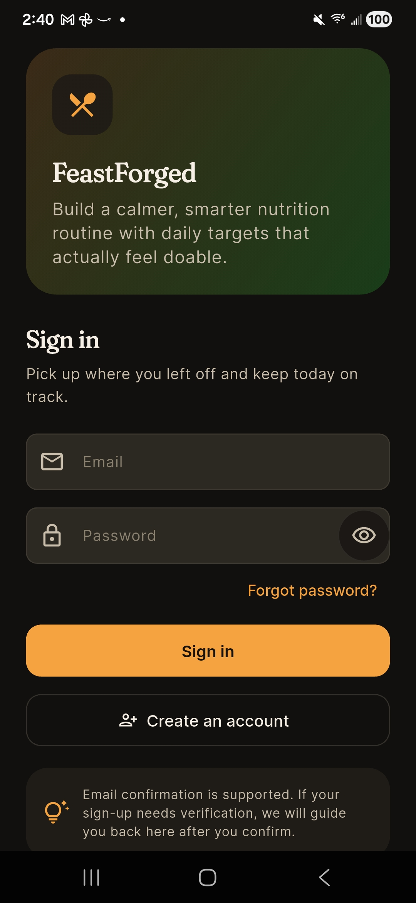
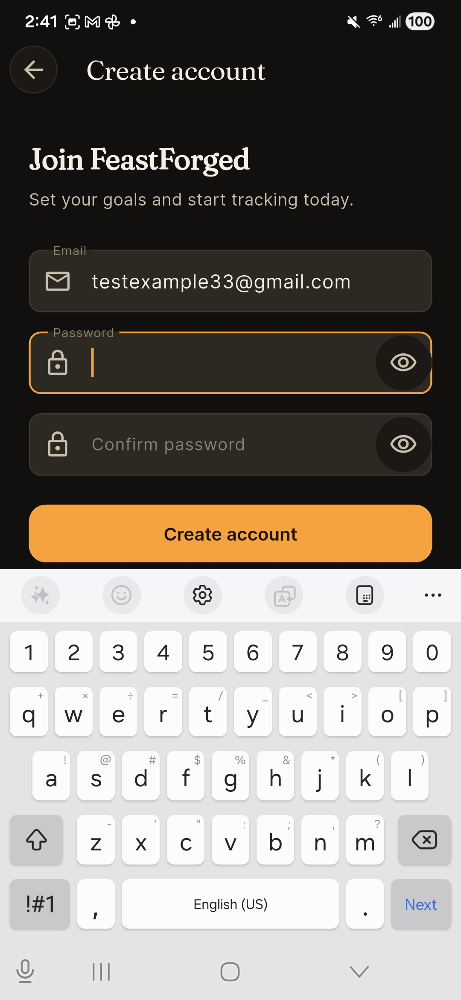
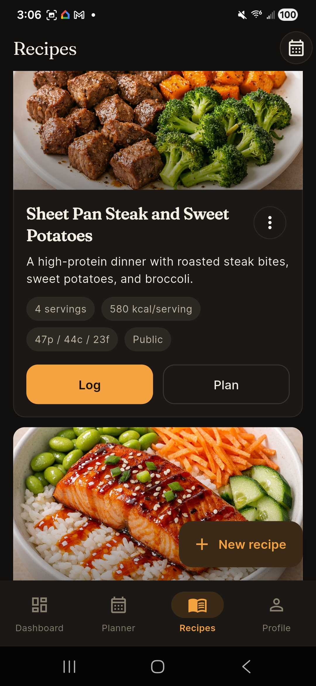

# FeastForged

> Hit your macros without feeling like you're starving.

A Flutter + Supabase nutrition app with recipe discovery, weekly meal planning, macro tracking, and a community recipe feed. Built as a real working product, not a UI demo — auth, RLS-secured data, SQL migrations, device-tested flows.

[](https://flutter.dev)
[](https://dart.dev)
[](https://supabase.com)
[](https://github.com/Ephox1/FeastForged)
[](LICENSE)

---

## Before / After — design system redesign

Mid-project I redesigned the entire app around a custom dark design system called **Forge**: dark-first palette, three-font type scale (Fraunces serif / Inter sans / JetBrains Mono for numerics), animated SVG macro rings, amber radial glow on hero cards.

**See the full diff:** [`main...forge-design-system`](https://github.com/Ephox1/FeastForged/compare/main...forge-design-system) — *9 files changed, 960 additions, 310 deletions, 1 atomic commit.*

| Before (Material 3 default) | After (Forge design system) |
| --- | --- |
|  | *Captured on device — see [compare branch](https://github.com/Ephox1/FeastForged/tree/forge-design-system)* |

The redesign introduced a single source of truth for tokens ([`design_tokens.dart`](lib/core/theme/design_tokens.dart)), a dark-first `ColorScheme` mapped explicitly (no `fromSeed`), and a reusable `ForgeTextStyles` helper that keeps numeric displays on tabular figures for clean alignment.

| Before — Material 3 default | After — Forge dark system |
| --- | --- |
|  |  |

---

## Screenshots — Forge build on device (Samsung R5CX11HNPLD)

| Sign in | Sign up | Dashboard | Recipes |
| --- | --- | --- | --- |
|  |  |  |  |

Notice the type scale doing real work: `Fraunces` serif for screen titles, `Inter` for body copy, `JetBrains Mono` with tabular figures for any number the user compares at a glance (calorie totals, macro splits, dates).

---

## What's in it

**Product flows**
- Email/password auth with forgot-password + reset-password lifecycle
- Onboarding that captures calorie + macro targets
- Dashboard with animated calorie ring and per-macro mini-rings
- Weekly planner → daily log handoff
- Recipe browse, detail, and create flows
- Community recipe feed with save/rate actions
- Shopping-list and household foundations

**Engineering**
- Supabase with RLS enabled on every table (`SELECT`/`INSERT`/`UPDATE`/`DELETE` policies using `auth.uid()`)
- Numbered, reversible SQL migrations
- Riverpod 2.x (plain providers, no codegen — see debugging story #1)
- GoRouter with auth-gated redirects via a `ChangeNotifier` listening to Supabase auth state
- `flutter analyze` passes clean, no suppressions
- Device-tested on a physical Android (Samsung R5CX11HNPLD)

---

## Debugging stories

Real issues I hit and how I worked through them. Written in the same format I'd use on a support ticket: **symptom → diagnosis → fix**.

### 1. `analyzer_plugin 0.12.0` broke the entire codegen pipeline

**Symptom:** `flutter pub get` resolved, but `dart run build_runner build` exploded with type errors inside `analyzer_plugin` — a transitive dep I never imported directly.

**Diagnosis:** `build_runner` 2.4 pulled `analyzer_plugin 0.12.0`, which was incompatible with the `analyzer` API shipped in Dart 3.8.1. Upgrading `build_runner` to 2.13+ forced `riverpod_generator` 4.x, which required Dart 3.9+. I was in a version-constraint dead-end.

**Fix:** Dropped all codegen packages (`build_runner`, `freezed`, `riverpod_annotation`, `riverpod_generator`, `custom_lint`) and rewrote providers in plain Dart. The deliberate tradeoff: lose a little boilerplate convenience, gain a stable toolchain today. Revisitable when the project moves to Dart 3.9+.

### 2. Android NDK version mismatch warning

**Symptom:** `flutter build apk` printed a multi-plugin warning about `path_provider_android`, `url_launcher_android`, and three others requiring NDK `27.0.12077973`, but the project was on `26.3.11579264`.

**Diagnosis:** Flutter plugins ship with minimum NDK versions in their manifests. When you don't pin an NDK version in `android/app/build.gradle.kts`, Gradle picks the installed SDK default, which may be behind the plugin requirements. The warning is non-fatal but signals drift.

**Fix:** Pinned `android { ndkVersion = "27.0.12077973" }` in the app-level Gradle file. Backward-compatible per Android docs, so no runtime impact on older devices.

### 3. "Invalid API key" on every Supabase call

**Symptom:** App built and launched, but every auth call returned `Invalid API key`.

**Diagnosis:** Supabase now issues two key formats — legacy JWT (`eyJ...`) and the newer publishable format (`sb_publishable_...`). I'd baked in a publishable key that looked right but was from a different project. The SDK rejected it with the same message either way.

**Fix:** Pulled the actual project's legacy JWT anon key and rebuilt with `--dart-define=SUPABASE_ANON_KEY=eyJ...`. Confirmed on device. Takeaway: prefer the project's legacy JWT anon key for `supabase-flutter` until every package in the SDK lineage fully supports publishable keys.

### 4. Curly apostrophe truncating a string literal

**Symptom:** Dart compiler error on the onboarding tagline: `'Hit your goals without feeling like you're starving.'`

**Diagnosis:** The apostrophe in "you're" was a Unicode curly quote (`\u2019`), which Dart treated as end-of-literal. Silent until the string contained a straight `'` character, which the curly one technically is not.

**Fix:** Wrapped the string in double quotes. Lesson: normalize quotes when pasting marketing copy into source.

### 5. Signup navigation firing on the wrong state transition

**Symptom:** After a successful signup, the app sometimes navigated to the dashboard before the email-confirmation screen, sometimes not at all.

**Diagnosis:** The listener compared `authState is AsyncLoading` — but `authState` was captured from the *previous* provider tick, so the condition raced with the actual state change.

**Fix:** Rewrote as `if (next is AsyncData<void> && !next.isLoading)` — check the incoming state, not the stale one. Straightforward once seen; easy to miss when you're thinking about it as "the current state."

---

## AI-assisted development, honestly

This project was built with heavy use of AI coding tools — Codex and Claude Code. I'm flagging that deliberately because (a) it's how modern engineering teams actually ship, and (b) applying to Cursor, I should be clear about what AI tools I'm fluent with.

**What I drove:** product decisions, architecture direction (feature-first layout, Riverpod vs. codegen, RLS-on-everything as a security policy), debugging through the five stories above, the Forge design system redesign brief, and final commit-hygiene / branch strategy decisions.

**What AI accelerated:** boilerplate (model classes, repository skeletons, route configuration), initial Supabase migration drafts, theme scaffolding, widget composition on known patterns.

**What breaks without a human:** debugging transitive dep version conflicts, diagnosing state-race bugs, reading device logs to figure out why nothing's rendering, choosing the right tradeoff when a codegen stack is wedged.

I think that's the honest split for any serious project right now, and it's why I'm excited about technical support work for an AI editor — I've lived both sides of the workflow.

---

## Architecture

```
lib/
  core/
    models/          # Pure Dart domain models
    routing/         # GoRouter + auth-gated redirect
    supabase/        # Supabase client
    theme/           # design_tokens.dart + app_theme.dart + ForgeTextStyles
  features/
    auth/            # Login, signup, reset, onboarding
    dashboard/       # Hero + rings + planned-meal sections
    nutrition/       # Recipe search, quick-add, log screens
    planner/         # Weekly planner + daily log handoff
    recipes/         # Browse, detail, create
    community/       # Feed, save, rate
    shopping/        # Shopping-list foundations
    profile/         # Target editing, preferences
    household/       # Household foundations
  shared/
    utils/
    widgets/
supabase/
  migrations/        # Numbered, reversible SQL migrations
  functions/         # Edge Functions (Deno/TypeScript) scaffold
```

---

## Running locally

1. Create a Supabase project (or connect an existing one).
2. Apply the SQL migrations in [`supabase/migrations`](supabase/migrations) via `supabase db push` or the SQL editor.
3. Run the app:

```bash
flutter run \
  --dart-define=SUPABASE_URL=https://your-project.supabase.co \
  --dart-define=SUPABASE_ANON_KEY=your-legacy-jwt-anon-key
```

**Verification before commit:**

```bash
flutter analyze   # must be clean
flutter test      # providers + repositories
```

---

## Supabase security posture

Every table has RLS enabled and explicit policies — no `USING (true)`, no service-role key client-side. The migrations under `supabase/migrations/` are the authoritative schema.

Auth flows covered:
- Sign-up with email confirmation
- Login with password
- Forgot-password → reset-password deep link
- Session refresh via `supabase-flutter` auth stream

---

## What I'd do next

- Full community review create/edit/delete verified on-device
- Shopping-list generation from planned recipes
- CI running `flutter analyze` + `flutter test` on every push
- Release instrumentation + crash reporting (Sentry)
- Store-ready Android signing + App Store submission assets

---

## Additional docs

- [MANUAL_SMOKE_TEST.md](MANUAL_SMOKE_TEST.md) — pre-release QA checklist
- [LAUNCH_CHECKLIST.md](LAUNCH_CHECKLIST.md) — launch-readiness notes
- [UX_REVIEW.md](UX_REVIEW.md) — design critique notes

---

## License

MIT — see [LICENSE](LICENSE).
